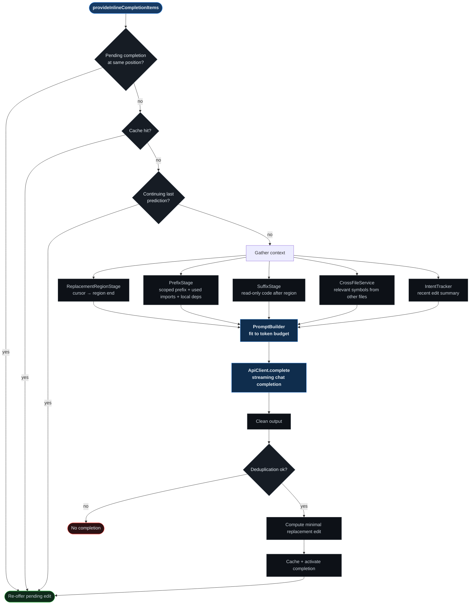

# supermaven

<p align="center">

</p>

A VS Code extension that provides **LLM-powered inline (Tab) code completions** - and treats completion as a _replacement_ problem rather than a prefix-append one. It can keep, insert, replace, or delete the code under the cursor.

`Tab` accepts a suggestion, `Escape` rejects it.

> **Status:** experimental (v0.0.1, private). See [Current status & limitations](#current-status--limitations).

---

## See it work

Ordinary tab completion only extends text to the right of the cursor. Most real editing needs more: fixing a half-written expression, filling a stub, or removing code that no longer belongs.

That is why the provider never asks for "the rest of the line". It marks out a **replace region** - the span the model is allowed to rewrite - and the reply is _the new contents of that region_.

Take a stub, with the cursor at the start of its body:

```ts
function area(w, h) {
  // TODO: compute area
}
```

The region handed to the model is `// TODO: compute area` (the cursor to the end of the line; if the line looks unfinished, the AST extends it to the enclosing statement, capped at 200 characters or 3 lines). The model replies with nothing but the replacement text:

```text
return w * h;
```

The provider then diffs that reply against the region and applies the minimal edit, as a single undoable operation:

```diff
 function area(w, h) {
-  // TODO: compute area
+  return w * h;
 }
```

Four kinds of change fall out of this one mechanism:

- **keep** - the region comes back unchanged, so nothing is applied.
- **insert** - new text is added at the cursor.
- **replace** - the region is rewritten in place.
- **delete** - code that no longer belongs is removed.

Because the model's output is diffed rather than inserted, a completion that would duplicate code already sitting below the cursor is discarded instead of being pasted in twice.

## Why this project exists

Most tab-completion extensions only extend the text to the right of the cursor. Real editing often requires something else: fixing a half-written expression, replacing a stub body, or removing code that no longer belongs. This project was built to explore what a completion engine looks like when it can _rewrite_ the region under the cursor, while still being fast and minimal enough to feel like native autocomplete.

The interesting engineering is not the API call - it is everything needed to make an LLM's raw output feel like a precise editor operation:

- selecting the right context under a hard token budget,
- grounding completions in the file's actual symbols and imports,
- cancelling stale requests,
- suppressing completions that duplicate code already present,
- turning free-form model text into a minimal, reversible edit.

## Key features

- **Region replacement, not just appending.** A dedicated stage computes the _replacement region_ (cursor → statement end) so the model can rewrite, not only extend, the current line/statement.
- **Minimal-edit application.** The model's output is diffed against the region and reduced to the smallest insert/delete pair, so accepted completions produce a clean, single undo step.
- **Scoped, budget-aware context.** The prefix is truncated to the enclosing function, and large functions are compressed to their setup plus a window of recent lines - with a language-aware truncation marker (`// ...`, `# ...`, `/* ... */`).
- **Import-aware prefixing.** Only the imports whose local names are actually referenced in the kept context are included, parsed per language (JS/TS, Python, Rust, Go, Java, C/C++).
- **Cross-file grounding.** A symbol index feeds relevant declarations from other open/saved files into the prompt as signatures, resolved through VS Code's language server.
- **AST assistance via Tree-sitter.** `web-tree-sitter` WASM grammars detect statement boundaries and extract declaration names and type/function signatures.
- **Deduplication.** Heuristic checks trim overlaps already above the cursor and reject completions that duplicate code below it (look-behind/look-ahead with approximate string similarity).
- **Caching.** An LRU + TTL bounded cache keys completions on file content hash, cursor position, and an edit-history hash; caches are invalidated per document.
- **Edit-history / intent tracking.** The extension records whether recent changes were `added`, `edited`, or `pasted`, plus `accepted`/`rejected` suggestions, and feeds a compact summary back into the prompt.
- **Streaming with cancellation.** Completions stream token-by-token and are aborted when a newer request arrives or the user moves on.
- **Continue prediction.** If the user types a prefix of the previous suggestion, the remaining text is offered without a new model round-trip.
- **Deletion previews.** Code that a completion would remove is highlighted with a strikethrough decoration before it is applied.

## How it works

The extension registers a single `InlineCompletionItemProvider` for all files. Each keystroke-triggered request flows through six stages:

<p align="center">
  
</p>

The diagram below expands the same pipeline stage by stage, including its fast-path exits and the no-completion branch.



Four things are worth knowing about that flow:

1. **Two fast paths run before any network call.** A content-hash-keyed cache is consulted first, then the provider tries to _continue_ a still-visible prediction if you are typing through it character by character. Typing through the whole suggestion clears it; typing something else resets it.
2. **Context is gathered in stages, under a hard budget.** The prefix is verbatim for small files; past 150 lines it is assembled from the imports the code actually references, same-file declarations the region depends on, the enclosing class header, and the enclosing function - with a language-aware marker (`// ...`, `# ...`, `/* ... */`) wherever lines were elided. Very long functions keep their first 30 lines plus a ~100-line window at the cursor.
3. **The suffix is deliberately small.** A short read-only look-ahead is included so the model does not re-emit code that already exists below the cursor.
4. **Stale work is cancelled.** Completions stream token by token and are aborted the moment a newer request arrives or the cursor moves, so an older reply can never land.

### The prompt contract

The model is not asked to "autocomplete code". It is given one precise job:

- `<prefix>` - code before the cursor, with an inline `<cursor />` marker at the exact boundary.
- `<replace_region>` - the text it **may** replace.
- `<suffix>` - read-only context after the region.
- `<types>` - signatures of relevant symbols from other files (optional).
- `<recent_edits>` - a summary of recent typing activity (optional).

The system prompt then constrains the answer to raw code: output **only** the replacement text for `<replace_region>`, no markdown, no prose, match the surrounding style, change as little as necessary. Ghost text is rendered at the replace range, and anything that would be deleted is decorated with a strikethrough before you accept it.

### Prompt budget

| Segment                                 | Budget (tokens) |
| --------------------------------------- | --------------- |
| System prompt                           | 1,000           |
| Current file (prefix + region + suffix) | 6,000           |
| Imported signatures                     | 3,000           |
| Edit history                            | 1,500           |
| Output space                            | 3,000           |
| Headroom / buffer                       | 1,000           |
| **Total**                               | **15,000**      |

Budgets are enforced with a ~4 characters/token estimate: the current file is the only segment that is trimmed by outranking the others, and signatures, edit history, and the current file each get their own cap. The length of the reply itself is bounded by `supermaven.maxTokens`.

## Supported languages

AST-assisted features use packaged Tree-sitter grammars. These VS Code language IDs are wired up today:

| Language | Grammar | Language | Grammar | Language | Grammar |
| --- | --- | --- | --- | --- | --- |
| Bash | `tree-sitter-bash` | C | `tree-sitter-c` | C++ | `tree-sitter-cpp` |
| CSS | `tree-sitter-css` | Go | `tree-sitter-go` | HTML | `tree-sitter-html` |
| Java | `tree-sitter-java` | JavaScript | `tree-sitter-javascript` | JSX | `tree-sitter-javascript` |
| Python | `tree-sitter-python` | Ruby | `tree-sitter-ruby` | Rust | `tree-sitter-rust` |
| Scala | `tree-sitter-scala` | TypeScript | `tree-sitter-typescript` | TSX | `tree-sitter-tsx` |

Import parsing and keyword sets are implemented for JS/TS, Python, Rust, Go, Java, and C/C++. Files in other languages still get completions, just without the language-specific AST and import assistance.

## Getting started

### Prerequisites

- [VS Code](https://code.visualstudio.com/) `^1.125.0` (or a compatible fork).
- [Bun](https://bun.sh/) - the repo pins `bun@1.3.14`.
- An API key for OpenRouter, Groq, or Fireworks.

### Install and build

```bash
# Install dependencies. This also runs the postinstall step that copies the
# Tree-sitter grammar .wasm files into ./grammars/
bun install

# One-off build (emits dist/extension.mjs and the unbundled modules)
bun run build

# Watch mode during development
bun run dev
```

The grammar copy step can be re-run on its own, for example after changing grammar dependencies:

```bash
bun scripts/setup-grammars.ts
```

### First run

1. Open this repository in VS Code and press **F5** to launch an Extension Development Host (the `Run Extension` configuration builds first).
2. In the new window, open **Settings**, search for `supermaven`, and add an API key for at least one provider.
3. Open a file and start typing - a grey inline suggestion appears.
4. Press **Tab** to accept it, or **Escape** to dismiss it.

The extension activates on `onStartupFinished` and logs to the **"Tab completion"** output channel. With no pending completion, `Tab` falls through to its normal editor behavior.

## Configuration

Everything lives under the `supermaven.*` namespace:

| Setting | Type | Default | Description |
| --- | --- | --- | --- |
| `supermaven.openrouterApiKey` | `string` | `""` | OpenRouter API key (highest-priority provider). |
| `supermaven.groqApiKey` | `string` | `""` | Groq API key. |
| `supermaven.fireworksApiKey` | `string` | `""` | Fireworks API key. |
| `supermaven.model` | `string` | `qwen/qwen3.8-27b` | Model used for tab completion. |
| `supermaven.maxTokens` | `number` | `500` | Max tokens to generate (50-5000). |
| `supermaven.completionCacheMaxEntries` | `number` | `100` | Max completion-cache entries (10-1000). |
| `supermaven.completionCacheTtlMs` | `number` | `30000` | Completion-cache TTL in milliseconds (5000-120000). |
| `supermaven.lspCacheMaxEntries` | `number` | `100` | Max LSP-result cache entries (10-1000). |

Inference is provider-agnostic over OpenAI-compatible streaming chat-completion endpoints. OpenRouter, Groq, and Fireworks are supported, and provider selection is deterministic: whichever key is set first in the order OpenRouter → Groq → Fireworks wins. Requests stream with `temperature: 0.1`; Groq requests additionally send `reasoning_effort: "none"`.

## Project structure

```
src/
├── extension.ts                            # Activation, provider wiring, accept/reject commands
├── lib/
│   ├── inline-completion-item-provider.ts  # Request pipeline / orchestration
│   ├── context-gatherer.ts                 # Assembles a CompletionContext
│   ├── prefix-stage.ts                     # Scoped, import-aware prefix construction
│   ├── replacement-region-stage.ts         # Cursor → region end
│   ├── suffix-stage.ts                     # Read-only suffix after the region
│   ├── local-dependency-resolver.ts        # Same-file symbols used in the prefix
│   └── api-client.ts                       # Provider selection + streaming HTTP client
├── services/
│   ├── prompt-builder.ts                   # XML prompt assembly + token budgeting
│   ├── intent-tracker-service.ts           # Edit-history / accept-reject tracking
│   ├── ast-service.ts                      # web-tree-sitter lifecycle + parsing
│   ├── lsp-service.ts                      # Document symbols & type hierarchy (cached)
│   ├── cross-file-service.ts               # Relevant symbols from other files
│   ├── deduplication-service.ts            # Overlap / duplicate suppression
│   └── config-service.ts                   # Typed, observable VS Code configuration
├── cache/
│   ├── bounded-cache.ts                    # LRU + TTL cache with group invalidation
│   └── completion-cache.ts                 # Completion cache keyed on content + edit hash
├── constants/                              # Language map, grammar paths, import patterns, prompts, defaults
├── types/                                  # Shared interfaces and type definitions
└── utils/                                  # Language/import/AST helpers, hashing, decorations
```

## Engineering notes

A few decisions that are not obvious from the file tree:

- **One cache type does the work everywhere.** `BoundedCache` is a single generic cache with LFU-style eviction (`accessCount / age`), optional TTL, and _group invalidation_ - dropping every entry for one document URI in a single call. It backs the completion cache, the LSP cache, the signature cache, and the symbol index.
- **The minimal edit is computed, not assumed.** `computeMinimalReplacement` walks a longest-common-prefix/suffix between the region and the reply, so accepting a completion yields a clean, reviewable diff and exactly one undo stop.
- **The symbol index invalidates itself.** Document symbols are cached per URI + version and refreshed on open and save; edits drop them by group.
- **The provider layer is stateless and flat.** A single OpenAI-compatible streaming client plus three provider configs, auto-selected by key presence. The only provider-specific branch in the codebase is the Groq `reasoning_effort` hint.

## Limitations

This is early-stage, experimental work. Before you rely on it:

- **No automated tests and no CI.** Validation is manual, through the Extension Development Host.
- **Context quality depends on the language server.** Cross-file symbols and enclosing-scope detection come from VS Code's document-symbol and type-hierarchy providers, which vary by language.
- **Grammar packaging is a build-time concern.** AST features need the `.wasm` files produced by `bun scripts/setup-grammars.ts`; without them the extension degrades to non-AST behavior.
- **Model output is noisy by nature.** There is defensive cleanup and deduplication, but completions are only as good as the configured model.
- **API keys are stored in VS Code settings**, not in a secrets store.

## Development

```bash
bun run build   # Build once (tsdown)
bun run dev     # Rebuild on change
bun run check   # Lint + format check (Ultracite: Oxlint + Oxfmt)
bun run fix     # Auto-fix formatting and lint issues
```

To debug, use the `Run Extension` launch configuration, or the `Watch Extension` task for a rebuild-on-save loop. Code style is governed by **Ultracite** - see [`AGENTS.md`](./AGENTS.md) for the full conventions.

### Contributing

- Commit messages follow the [Conventional Commits](https://www.conventionalcommits.org/) spec, enforced by commitlint via `commitlint.config.ts`.
- A Husky `pre-commit` hook runs `lint-staged`, which formats and lints staged files with `bun x ultracite fix`. Running it yourself before committing is recommended.
- There is currently no test suite or CI workflow to satisfy - see [Limitations](#limitations).

## License

Released under the [MIT License](./LICENSE).
